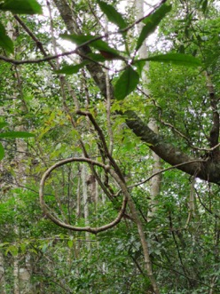

&emsp;&emsp; 福建永定王寿山森林公园植被茂密，动植物种类繁多，个体形态独特。半山以上保存着成片的原始热带雨林，其中植物266个科1986种，昆虫128个科1341种，国家级保护动物就有19种。王寿山有许多名贵树和花，山上常年翠绿葱郁，松树、杉树、莲子树等等，有的树冠浓郁如华盖，有的树干挺拔直插云霄。山茶、山药、山果遍布，各种蘑菇，还栖息着多种飞禽走兽。进入王寿山中，随处可见古藤盘错攀缘，百态千姿；满耳可闻山涧清泉潺潺，伴和鸟啼虫鸣。古树、异木、山花、芳草点缀着山间古道，争妍斗胜，令人流连忘返。

>被采割松香多年的松树，它类似橡胶，是重要的工业原料。沉在水中，千年不腐，南靖有座土楼建造在沼泽地上，其地基就是用松树作为架构的

>可投篮的树和藤

&emsp;&emsp; 莲子，长在高高的树上，是一种壳斗科的坚果，学名钩栲。果坚，壳硬，硬壳外还包着一层毛茸茸的刺，像一只卷曲着的刺猬，秋天果熟了，满树的“刺猬”啪啦啦往下掉，摔得皮开果现，你只须敲敲打打，扫开“刺猬”皮，一地的“莲子”可就随意捡拾了。

&emsp;&emsp; 王寿山有一种珍稀植物——桫椤。它生长在王寿山的深山，是现存唯一的木本蕨类植物，极其珍贵，堪称国宝。被许多国家列为一级保护的濒危植物。

>桫椤

&emsp;&emsp; 杨梅是王寿山的一大特色。每年五月，正是杨梅成熟的时候，王寿山漫山遍野的杨梅像白鹤头上的“红色鹤顶”一样，也像血未干的“龙睛”一样，如成熟的荔枝，甜酸多汁可口。
&emsp;&emsp; 王寿山杜鹃花是一大看点。每年春天，王寿山成片成片火红的杜鹃花开得争奇斗艳，桃花和芙蓉自愧不如。

>杜鹃花

[刘德标石杰 新浪博客](http://blog.sina.com.cn/s/blog_15dee421d0102zhda.html)